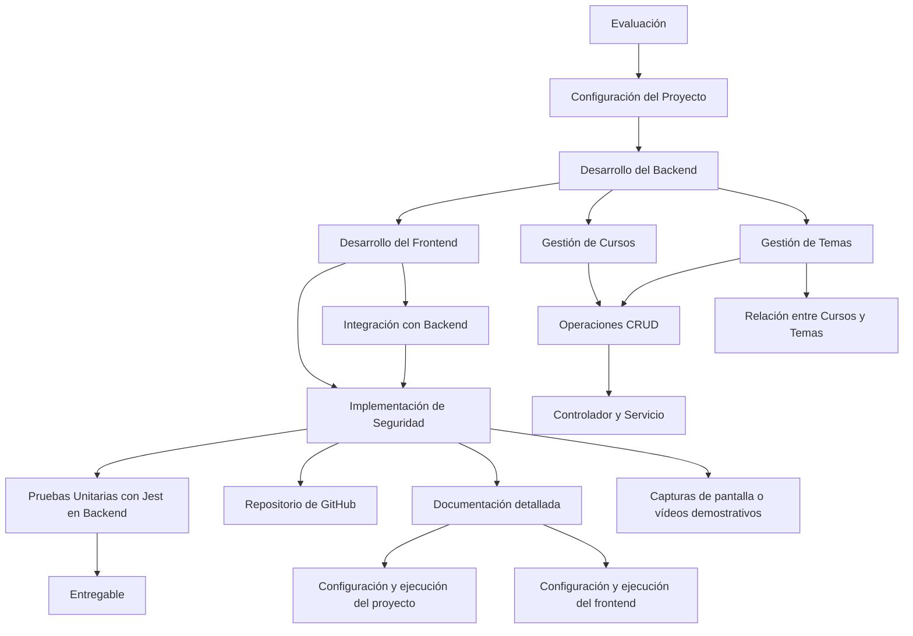

# Sistema de Gestión de Cursos para Docentes

## Configuración del Proyecto

Se utiliza Nest.js para configurar el backend y se establece una base de datos MongoDB para almacenar la información de los cursos y los temas.

## Desarrollo del Backend

Se crea un módulo para la gestión de los cursos, con operaciones CRUD, así como un controlador y un servicio para la lógica de negocio relacionada. Se desarrolla también un módulo para la gestión de los temas de los cursos, estableciendo la relación entre cursos y temas.

## Desarrollo del Frontend (opcional)

Se utiliza Angular, React o Vue.js para desarrollar el frontend, diseñando e implementando la interfaz de usuario para la gestión de cursos y temas. Se integra la interfaz de usuario con el backend mediante peticiones HTTP para consumir los endpoints RESTful.

## Implementación de Seguridad

Se implementan medidas de seguridad en el backend para proteger las rutas y acciones del sistema, utilizando técnicas como la autenticación basada en tokens JWT.

## Pruebas Unitarias con Jest en Backend

Se escriben pruebas unitarias para verificar el correcto funcionamiento de los controladores y servicios del backend, utilizando Jest como framework de pruebas.

## Entregable

Se entrega un repositorio de GitHub con el código fuente del proyecto, documentación detallada sobre la configuración y ejecución del proyecto (tanto en el frontend como en el backend), y capturas de pantalla o vídeos demostrativos que muestren el sistema en funcionamiento.

Para visualizar y probar la generación del sistema backend y su consumo desde un Frontend, puedes utilizar herramientas como Thunder Client, Postman, Insomnia o RapidApiClient. Estas herramientas permiten realizar solicitudes HTTP a los endpoints del backend, lo que facilita la visualización de los datos y el funcionamiento del sistema en tiempo real.